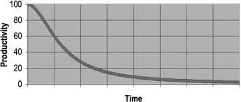

# Capítulo  1 - Código Limpo
Nesse capítulo o autor irá abordar principalmente sobre o que é Código Limpo.

## Principais tópicos

### O custo de ter um código confuso
O autor ressalta que o código sujo as vezes parece tentador, principalmente com a pressão e prazos, mas o que nem todo mundo leva em conta é que a médio/longo prazo a sujeira no código dificulta a produtividade.

### O que é um Código Limpo?
- O código limpo proporciona uma leitura natural
- Faz bem e com clareza apenas uma coisa (Single responsibility)
- Tem tratamento de erros completos
- Tem testes unitários e de aceitação
- Nomes significativos
- Fácil de manter e melhorar
- Pouca ou nenhuma repetição de código
- Preservação da capacidade de alteração no futuro
- Abstraido para evitar redundâncias

### Regra do escoteiro
"Deixe a área do acampamento mais limpa do que como você a encontrou"

Aplicando essa regra para a programação seria:

Deixe o seu código mais limpo do que como você o encontrou